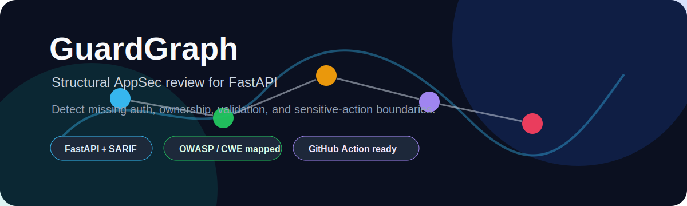

<p align="center">
  
</p>

<h1 align="center">GuardGraph</h1>

<p align="center">
  <b>Structural AppSec review for FastAPI applications.</b>
  <br />
  Detect missing auth, ownership, validation, and sensitive-action boundaries.
</p>

<p align="center">
  
  
  
  
  
</p>

---

## What is GuardGraph?

Traditional scanners usually search for:

- unsafe functions;
- vulnerable dependencies;
- dangerous source-to-sink flows;
- known signatures.

GuardGraph focuses on a different class of risk:

> missing security boundaries around sensitive application actions.

For every endpoint, GuardGraph asks:

1. What does this endpoint do?
2. What resource does it access or mutate?
3. Which security obligations should protect this action?
4. Are those protections visible in the code path?

---

## Threefold Structural Gap Analysis

```text
user input
    ↓
endpoint action classification
    ↓
required security obligations
    ↓
observed guards / boundaries
    ↓
structural gap detection
```

GuardGraph builds three structural views:

| Graph | Purpose |
|---|---|
| `DataExposureGraph` | Tracks user-controlled input, validation, and sensitive sinks |
| `AccessBoundaryGraph` | Tracks auth, ownership, permissions, and dependency boundaries |
| `StateMutationGraph` | Tracks writes, deletes, payments, uploads, and admin actions |

Implementation modules:

```text
guardgraph/analyzer.py
guardgraph/graphs.py
guardgraph/parser.py
```

---

## Detection classes

| English title | Display label | Internal metric | OWASP / CWE |
|---|---|---|---|
| Unguarded State Change | Слепой переход | `PUBLIC_MUTATION` | A01 / CWE-862, CWE-306 |
| Missing Ownership Boundary | Чужой паспорт | `MISSING_OWNERSHIP_BOUNDARY` | A01 / CWE-639, CWE-862 |
| Raw Input to Sensitive Sink | Голый провод | `RAW_INPUT_TO_SINK` | A03 / CWE-89, CWE-20 |
| Critical Action Without Guard | Кнопка без крышки | `CRITICAL_ACTION_WEAK_ZONE` | A01 / CWE-862, CWE-732 |
| Unvalidated Public Entry | Открытая форма | `PUBLIC_ACTION_UNVALIDATED` | A04 / CWE-20, CWE-770 |
| Unsafe Upload Boundary | Открытая загрузка | `UNRESTRICTED_UPLOAD_BOUNDARY` | A01 / CWE-434, CWE-284 |

Every finding includes:

```json
{
  "review_required": true,
  "exploit_confirmed": false,
  "evidence_strength": "STRONG",
  "owasp_category": "A01:2021-Broken Access Control",
  "cwe": ["CWE-862"]
}
```

---

## Example finding

```text
🚨 CRITICAL
Critical Action Without Guard

POST /api/pay/process

Observed flow:
POST /api/pay/process → process_payment → payment_service.charge

Missing obligations:
- AUTH_REQUIRED
- ROLE_OR_PERMISSION_REQUIRED
```

---

## FastAPI Dependency Injection benchmark

GuardGraph includes a dedicated benchmark for real FastAPI dependency patterns:

- `Depends(get_current_user)`
- `Annotated[..., Depends(...)]`
- route-level dependencies
- router-level dependencies
- dependency aliases
- keyword-only endpoint parameters after `*`
- nested admin-style dependencies

Benchmark location:

```text
benchmarks/fastapi_di_app/
```

### Real-project smoke test

GuardGraph v0.4.3 was smoke-tested against:

```text
fastapi/full-stack-fastapi-template
backend/app
```

Results:

| Metric | Result |
|---|---|
| Endpoints found | 23 |
| Critical findings on protected endpoints | 0 |
| High findings on protected endpoints | 0 |
| Remaining findings | 2 medium public-entry review notes |

This validation specifically tested whether GuardGraph incorrectly reports protected `CurrentUser` endpoints as missing authentication.

---

## Quick start

### Local CLI

```bash
python -m guardgraph --config guardgraph.yml --sarif guardgraph_report.sarif
```

Or directly:

```bash
python -m guardgraph tests/test_app \
  -o guardgraph_report.json \
  -m guardgraph_report.md \
  --sarif guardgraph_report.sarif
```

---

## GitHub Action

```yaml
name: GuardGraph

on:
  pull_request:
  workflow_dispatch:

permissions:
  contents: read
  security-events: write
  pull-requests: write
  issues: write

jobs:
  guardgraph:
    runs-on: ubuntu-latest

    steps:
      - uses: actions/checkout@v4

      - name: Run GuardGraph
        uses: marieabdlk-art/guardgraph@v0.4.3
        with:
          config-path: guardgraph.yml
          pr-comment: "true"
          upload-artifacts: "true"
          sarif-output: guardgraph_report.sarif

      - name: Upload SARIF
        uses: github/codeql-action/upload-sarif@v3
        with:
          sarif_file: guardgraph_report.sarif
```

---

## SARIF support

GuardGraph emits SARIF 2.1.0 compatible with:

- GitHub Code Scanning
- GitHub Advanced Security
- VS Code SARIF viewers
- IDE integrations

Run:

```bash
python -m guardgraph --config guardgraph.yml --sarif guardgraph_report.sarif
```

---

## Project structure

```text
guardgraph/
├── analyzer.py      # core detection pipeline
├── graphs.py        # structural graph layer definitions
├── parser.py        # FastAPI AST parsing
├── cli.py           # CLI entrypoint
└── models.py        # report models

benchmarks/
├── fastapi_di_app/
└── fixtures/

tests/
└── test_guardgraph.py
```

---

## Limitations

Current MVP limitations:

- Python + FastAPI only
- heuristic structural analysis
- not proof of exploitability
- limited interprocedural analysis
- findings require human review

GuardGraph reports structural risk zones, not confirmed exploits.

---

## Why not just taint tracking?

Classic taint tracking asks:

> Can untrusted input reach a dangerous sink?

GuardGraph asks:

> Given what this endpoint does, which security obligations must exist, and are they visible in the code path?

That makes ownership and access-control gaps first-class findings instead of incidental patterns.

---

## Contributing

See:

```text
CONTRIBUTING.md
```

---

## License

MIT License © 2026 A. Abdulkarimova
